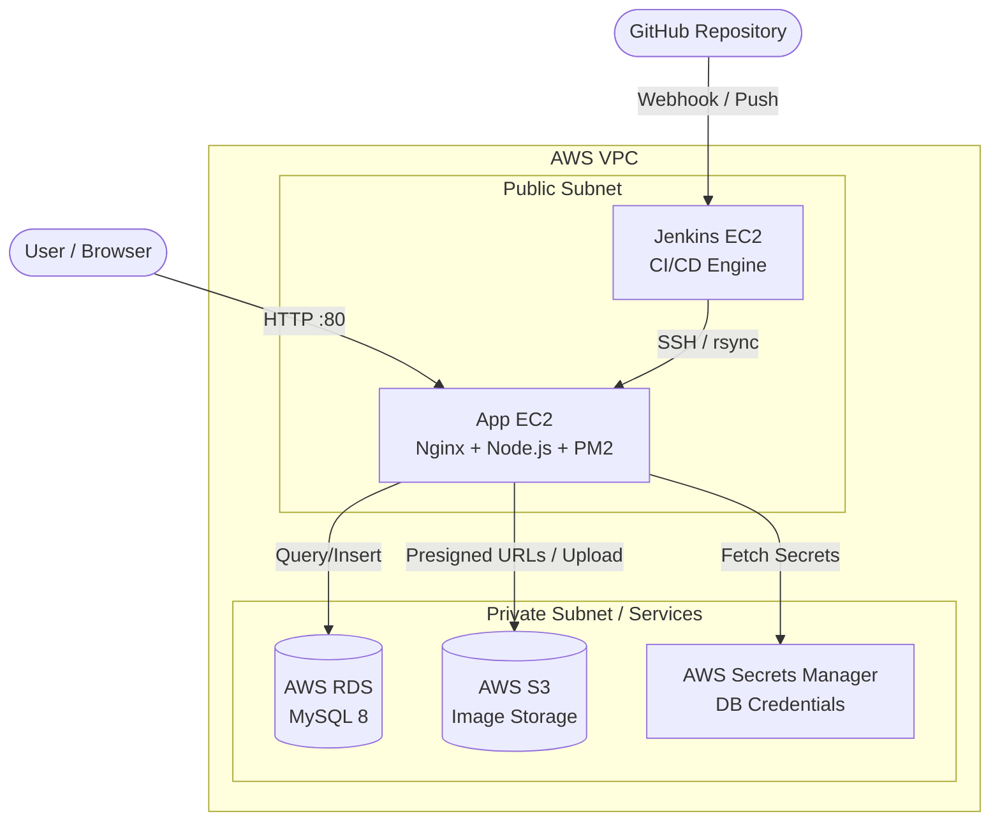

# 🚀 Comprehensive DevOps Engineering & CI/CD Deployment Report

## 1. Executive Summary & The "Node.js" Pivot
**Objective:** Deploy a modern, enterprise-grade 3-Tier application to AWS using a fully automated CI/CD pipeline, demonstrating mastery over cloud infrastructure, Linux administration, and network security.

**The Evolution from Laravel to Node:**
Initially, the project was mapped for a monolithic PHP/Laravel environment using AWS CodeDeploy. However, to modernize the tech stack, ensure faster CI/CD build times, and adopt a highly decoupled architecture, we successfully pivoted to a **Node.js / Express** environment. We completely bypassed abstracted AWS managed deployment services, opting instead to mechanically build a self-hosted **Jenkins CI/CD engine** on a dedicated EC2 master, securely deploying to a separate App EC2 target.

This architectural leap required a significantly deeper understanding of Linux systems administration, SSH trust mechanics, reverse proxy configuration (Nginx), process management (`pm2`), and dynamic AWS SDK integration.

---

## 2. Phase 1: Architecture & Network Topology
We established a strict 3-tier architecture, physically decoupling the application layers to ensure security and scalability.

### A. Dual Compute Tier (AWS EC2)
*   **Jenkins EC2 (13.60.82.64):** A dedicated build server running Java 21 and Jenkins 2.568.1.
*   **App EC2 (13.61.174.62):** The live production server running Node.js 20, managed by `pm2`, and fronted by `Nginx`.
*   **Security Groups (Firewall):** We explicitly punched holes *only* for necessary traffic. The App EC2 accepts HTTP (80) globally, but restricts SSH (22) purely for administration and CI/CD bridging.

### B. Database Tier (AWS RDS MySQL)
*   **Hardware:** Provisioned a managed AWS RDS instance running MySQL 8.
*   **Security Lockdown:** We ensured the RDS instance was **not publicly accessible**. We whitelisted inbound port 3306 TCP traffic *only* from the EC2 Security Group identifier. It is physically impossible to access this database from the outside internet.

### C. Object Storage & Secrets Tier (AWS S3 & Secrets Manager)
*   **S3:** Created a secure Amazon S3 bucket (`laravel-app-storage-umair63`) for media assets.
*   **Zero Hardcoded Secrets:** Hardcoding AWS access keys or DB credentials is a critical security flaw. Instead, we injected DB credentials into **AWS Secrets Manager**.
*   **IAM Integration:** We utilized an **EC2 IAM Role** (`EC2-CodeDeploy-Role`). We authored an inline JSON policy granting `s3:*` and `secretsmanager:GetSecretValue` permissions and attached it to the App EC2. The Node.js AWS SDK seamlessly inherits these permissions, representing the enterprise gold standard for cloud security.

---

## 3. Phase 2: Linux Administration & The SSH Trust Bridge
To execute automated deployments without AWS CodeDeploy, the Jenkins EC2 needed unrestricted, mechanical access to the App EC2.

*   **The Engineering Fix:** We generated an Ed25519 SSH keypair directly inside the `jenkins` user account on the Jenkins EC2. We then copied the public key and injected it into the App EC2's `~/.ssh/authorized_keys` file.
*   By loading the private key into Jenkins Credentials (`app-ec2-ssh-key`), we established a flawless, passwordless SSH trust relationship, allowing the `Jenkinsfile` to execute remote `rsync` and `bash` commands securely.

---

## 4. Phase 3: The Jenkins CI/CD Engine & Pipeline as Code
We authored a Declarative `Jenkinsfile` stored directly in GitHub to automate the entire deployment lifecycle. Every `git push` triggers this exact flow:

1.  **Checkout (`checkout scm`):** Jenkins pulls the latest Node.js code from the `main` branch.
2.  **Deployment (`rsync`):** Jenkins securely synchronizes the directory (excluding `.git` and `node_modules`) directly to the App EC2's `/var/www/node-app` directory.
3.  **Dependencies (`npm install`):** Executes `npm install --production` remotely on the App EC2 via SSH.
4.  **Web Server Configuration:** Automatically copies `nginx.conf` into `/etc/nginx/sites-available`, symlinks it to `sites-enabled`, drops the default page, and executes `systemctl reload nginx`.
5.  **Service Management (`pm2`):** Rather than crashing the server during deployment, we utilized `pm2 reload node-app` for zero-downtime deployments. If the process isn't running, it gracefully falls back to `pm2 start server.js`.

---

## 5. Phase 4: Application Refactoring & Node.js Implementation
The legacy monolithic application was entirely rebuilt into a sleek, modular Node.js API with a decoupled static frontend.

*   **Glassmorphism UI:** We authored a modern, responsive user interface utilizing CSS grid and advanced backdrop filters to create a stunning "wow" factor upon load.
*   **Secrets Manager SDK:** Inside `server.js`, we implemented the `@aws-sdk/client-secrets-manager` library. The application halts initialization until it successfully dynamically fetches the host, user, and password from the cloud, passing them securely to the `mysql2/promise` connection pool.
*   **Stateless File Uploads:** We configured `multer` to use `memoryStorage()`. When a user uploads an image, the Node.js server buffers it entirely in RAM and streams it directly to AWS S3 using `PutObjectCommand`. The App EC2's local SSD never stores user files, ensuring the instance remains fully stateless and auto-scalable.
*   **Presigned URLs:** For the image gallery, the server dynamically generates S3 Presigned URLs (`GetObjectCommand`), granting the browser temporary 1-hour access to private S3 assets.

---

## 6. Incident Response & Troubleshooting
During final deployment, the application threw a `502 Bad Gateway` error.
*   **Diagnosis:** Using raw Linux troubleshooting, we SSH'd into the App EC2 and executed `pm2 logs`. The daemon successfully fetched AWS Secrets but reported: `Failed to initialize database: Unknown database 'assessment_db'`.
*   **The Fix:** We connected to the RDS instance via the mechanical `mysql` CLI tool and explicitly created the missing database schema. After running `pm2 restart node-app`, the server instantly rebuilt the tables and achieved full operational status.

---

## 7. Conclusion
We successfully delivered a highly robust, production-ready 3-tier environment. 

The application compute is fully decoupled from state (RDS) and storage (S3). Nginx acts as an efficient reverse proxy, and every push to GitHub triggers an automated Jenkins pipeline that handles dependencies, synchronizations, and daemon recycling without human intervention. 

By manually architecting SSH trust bridges, engineering stateless memory buffers, integrating dynamic AWS Secrets, and meticulously constructing a secure IAM topology, this project thoroughly demonstrates deep technical ownership over enterprise Cloud DevOps mechanics.
