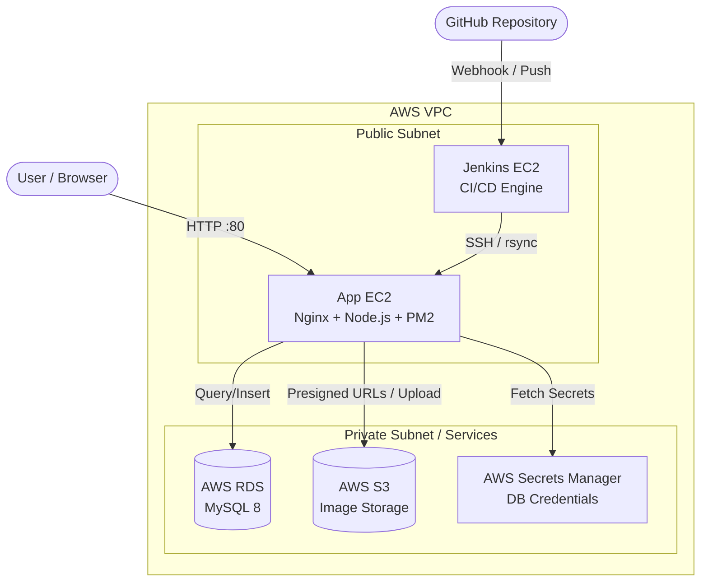

# 🚀 AWS DevOps 3-Tier Architecture Assessment

## Overview
This repository contains the infrastructure configuration, CI/CD pipeline, and application code for a production-grade 3-Tier web architecture deployed entirely on AWS.

The backend has been completely replatformed to **Node.js / Express**, featuring a custom glassmorphism UI, secure database integration via **AWS Secrets Manager**, and direct file uploads to **AWS S3** using presigned URLs. The deployment is fully automated using a dedicated **Jenkins EC2** server communicating securely over SSH to an **App EC2** target.

---

## 🏗️ Architecture Diagram

## ✨ Key Features & Technical Decisions

1. **Dual EC2 Compute Tier:** 
   - **Jenkins Master:** Dedicated to CI/CD. Pulls code, installs dependencies, and deploys via SSH.
   - **App Target:** Runs Nginx (Reverse Proxy) and Node.js managed by `pm2` for zero-downtime reloads.
2. **Zero Hardcoded Secrets:** DB credentials are dynamically fetched at runtime using `@aws-sdk/client-secrets-manager`.
3. **Stateless Node Application:** The application uses `multer` memory storage to immediately stream uploaded images to AWS S3, ensuring the App EC2 remains completely stateless.
4. **IAM Role Authentication:** EC2 instances securely interact with Secrets Manager and S3 using attached IAM roles (`EC2-CodeDeploy-Role`), avoiding exposed AWS access keys.

---

## 🛠️ Detailed Walkthrough

### Step 1: AWS Infrastructure Setup
1. **EC2 Instances:** Provisioned two Ubuntu 24.04 instances (`Jenkins` and `AppServer`).
2. **Security Groups:** 
   - `AppServer`: Port 80 (HTTP) open to the world. Port 22 (SSH) open to Jenkins and admin IP.
   - `RDS`: Port 3306 (MySQL) open ONLY to the `AppServer` Security Group.
3. **AWS RDS:** Provisioned a MySQL instance.
4. **AWS S3:** Created a private bucket for media storage.
5. **Secrets Manager:** Stored RDS endpoint, username, and password in a secret named `assessment-db-secret`.
6. **IAM Roles:** Created `EC2-CodeDeploy-Role` with an inline policy allowing `s3:*` and `secretsmanager:GetSecretValue`. Attached this role to the App EC2.

### Step 2: Jenkins Configuration
1. Installed **Java 21** and Jenkins on the Jenkins EC2.
2. Generated an SSH keypair on Jenkins and injected the public key into the App EC2's `~/.ssh/authorized_keys`.
3. Added the private key to Jenkins Credentials as `app-ec2-ssh-key`.
4. Configured a GitHub Webhook to automatically trigger builds on `git push`.

### Step 3: CI/CD Pipeline Execution
The `Jenkinsfile` orchestrates the fully automated flow:
1. **Checkout:** Pulls latest Node.js code from GitHub.
2. **Sync:** Uses `rsync` over SSH to push the code to the App EC2 (`/var/www/node-app`).
3. **Install:** Executes `npm install --production` remotely.
4. **Configure:** Moves `nginx.conf` into `/etc/nginx` and reloads the Nginx service.
5. **Restart:** Uses `pm2 restart node-app` to seamlessly reboot the application.

### Step 4: Verification
- Accessing the App EC2's public IP loads the beautiful Glassmorphism UI.
- Submitting a new record fetches secrets, connects to RDS, inserts data, and uploads images to S3!
